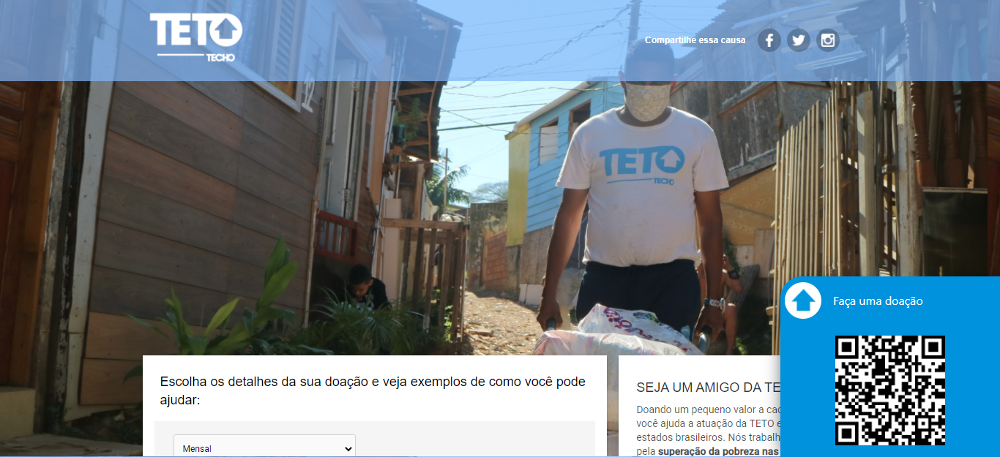
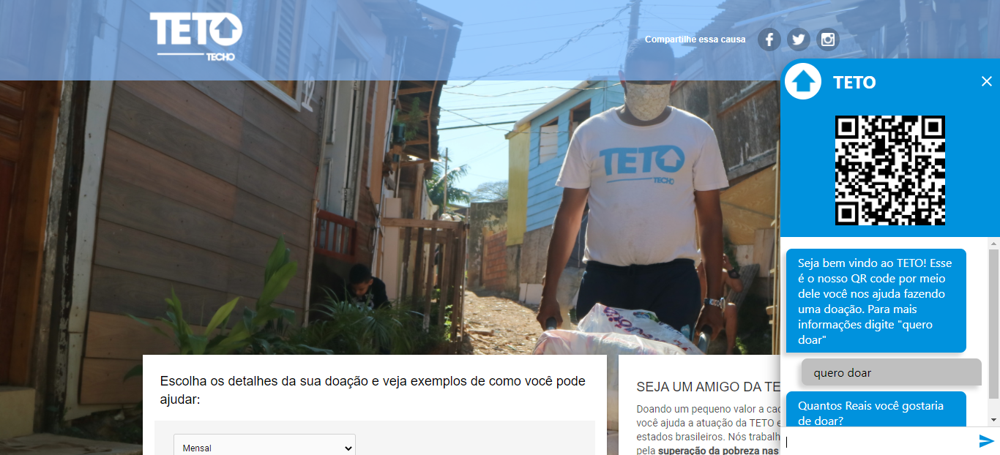
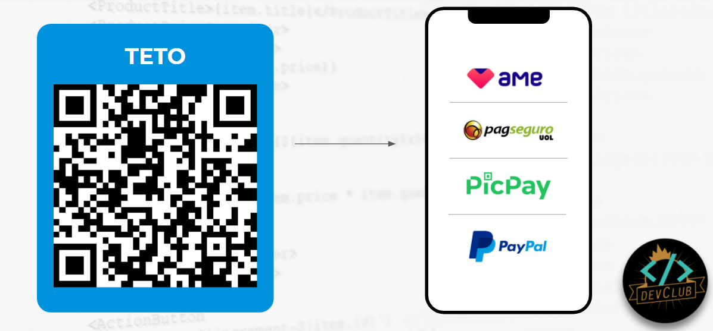

Acesse o projeto em [Leia chatbot TETO](https://master.d275hyjadvv3f3.amplifyapp.com/).

## Desafio Extra TETO

Este projeto foi desenvolvido como desafio extra para o Hiring Coders Vtex 2020.

Tomando como partida a necessidade de implementar novos meios de pagamento que facilitem doações para a ONG TETO, desenvolvemos uma proposta que tira proveito das mais modernas tecnologias de transação bancária atreladas ao poder de interação promovido pelo Leia chatbot.

Por meio de um QR code o usuário é levado para o PicPay da instituição e caso tenha alguma dúvida pode consultar o chatbot. Propiciando um maior engajamento no momento da visita ao site. 

- Leia chatbot fechado 

- Leia chatbot aberto 

### Proposta expandida

Como implementação futura. Ao invés de o QR code ser atrelado a apenas um meio de pagamento o ideal é que o usuário seja encaminhado para uma tela contendo diversos serviços. Por exemplo Ame, Pag Seguro, PayPal...
Dessa forma basta que seja clicada a opção desejada para entrar diretamente no aplicativo. Como vantagem existe a redução de burocracia no momento da doação. 

